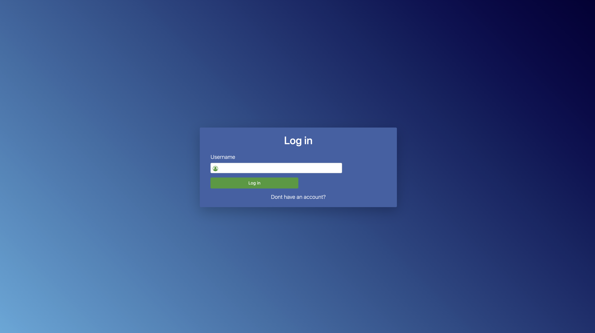
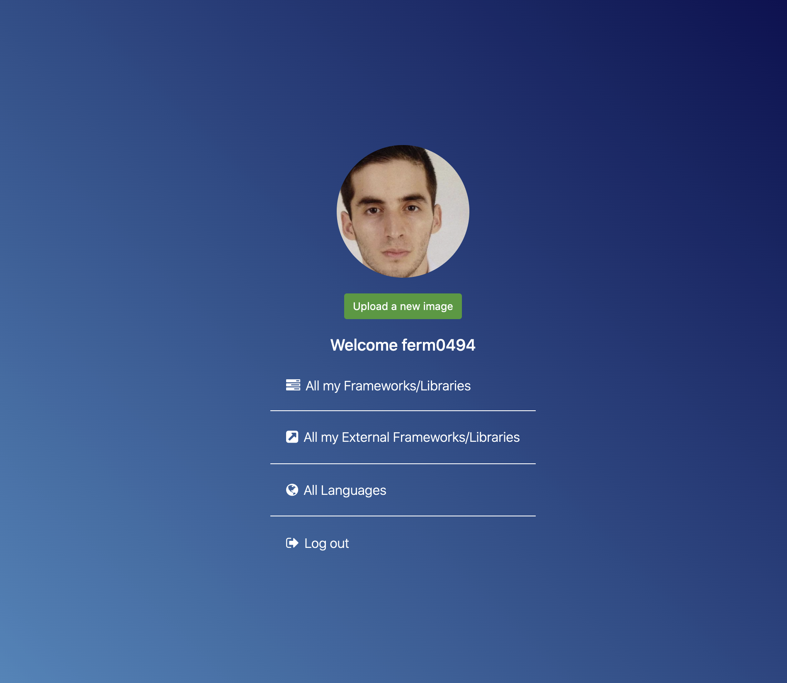
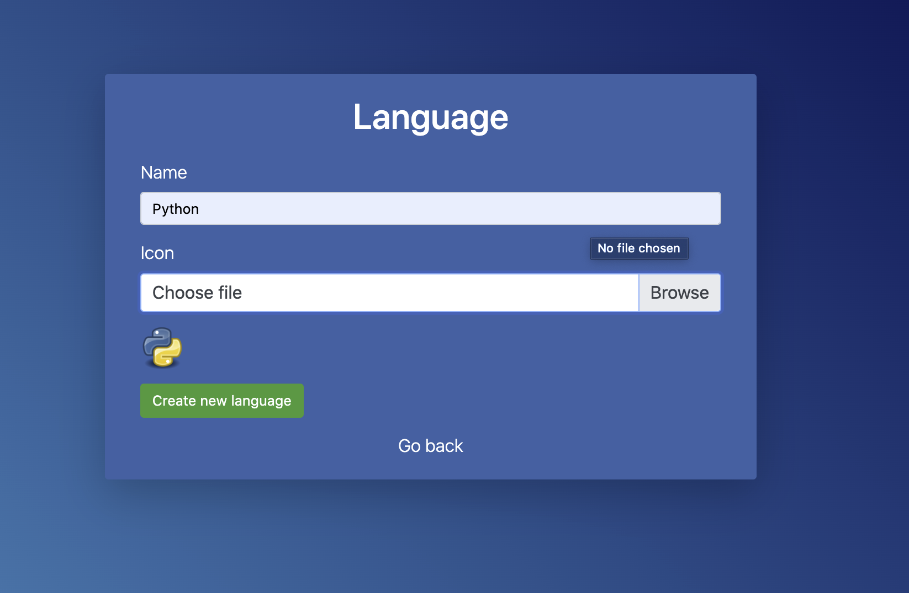
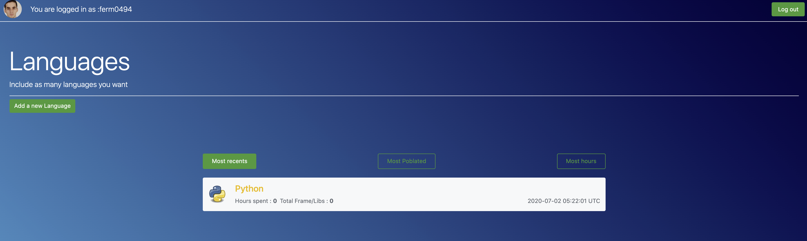
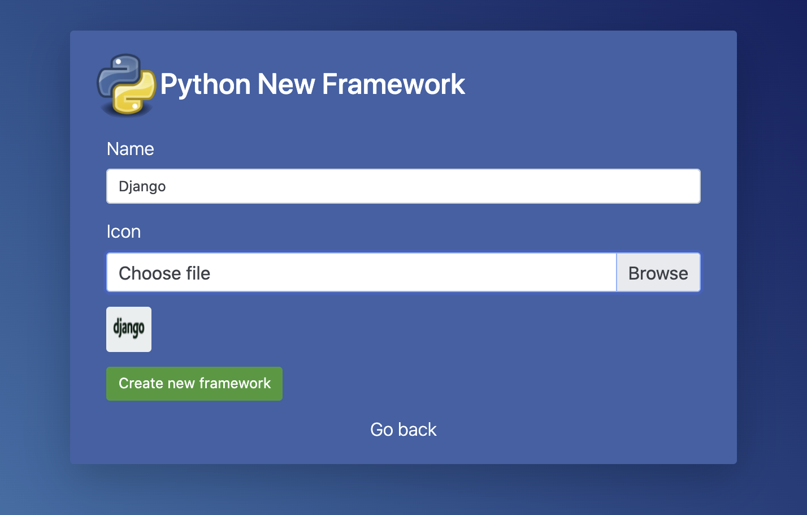
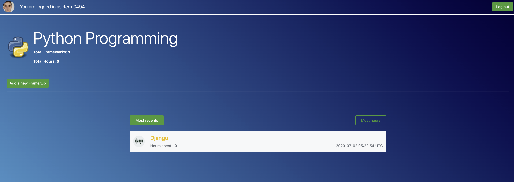
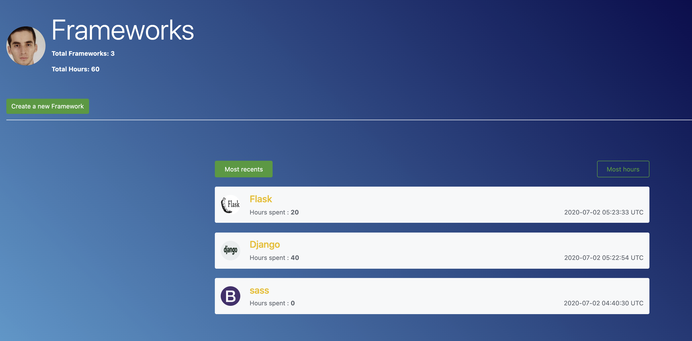
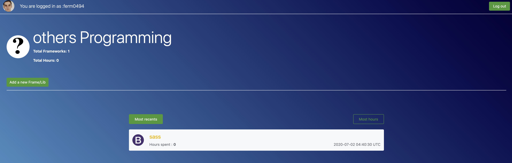

# Tracker Languages progress APP

> Social media stay in touch











## Built With

- Ruby v2.7.0
- Ruby on Rails v5.2.4
- Bootrstrap
- SASS


## Live Demo

https://fathomless-brook-88773.herokuapp.com


## Getting Started

To get a local copy up and running follow these simple example steps.

### Prerequisites

Ruby: 2.6.3
Rails: 5.2.3
Postgres: >=9.5

### Setup

Instal gems with:

```
bundle install
```

Setup database with:

```
   rails db:create
   rails db:migrate
```


### Usage

Start server with:

```
    rails server
```

Open `http://localhost:3000/` in your browser.

### Run tests

```
    rpsec 
```


## Authors

👤 **Fernando**

- Github: [@Ferm0494](https://github.com/Ferm0494)
- Twitter: [@ferm494](https://twitter.com/ferm494)
- Linkedin: [@Ferm0494](https://www.linkedin.com/in/ferm0494/)
## 🤝 Contributing

Contributions, issues and feature requests are welcome!

Feel free to check the [issues page](issues/).

## Show your support

Give a ⭐️ if you like this project!

## Acknowledgments

TBA

## 📝 License

TBA

